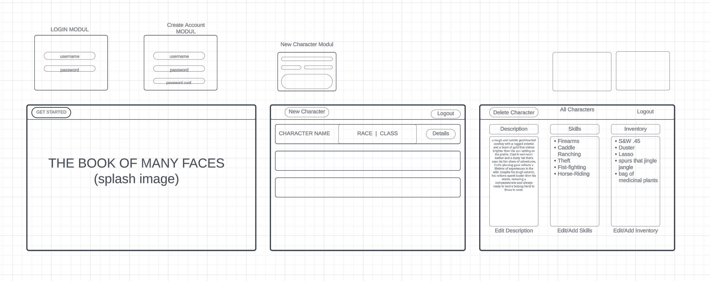
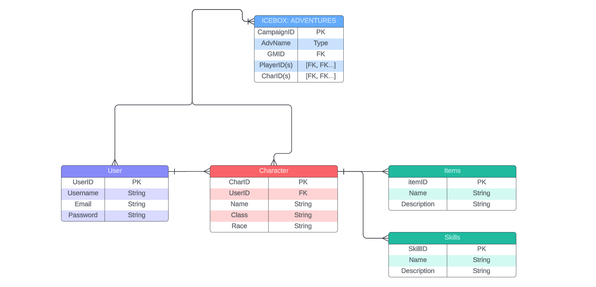
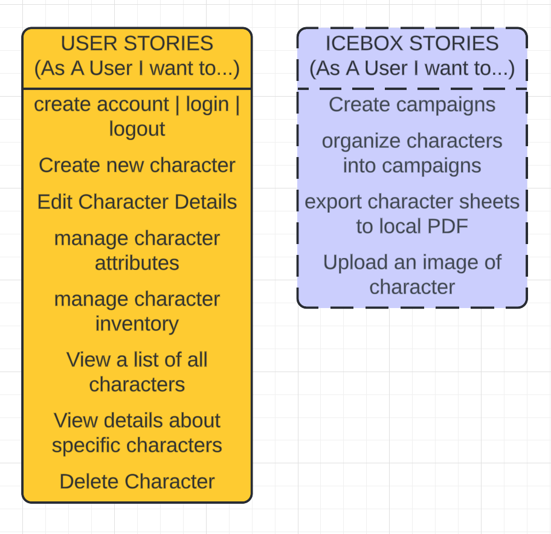

# THE BOOK OF MANY FACES CLIENT
### Consumes the API (of) MANY FACES | [Found Here](https://github.com/Clund1/BookOfManyFacesAPI)

## Description
"The Book of Many Faces" is an application designed to help Pathfinder 2e players and game masters manage and keep track of their characters in a user-friendly and organized manner. 

Whether you are a Game Master managing NPCs or a player with a diverse array of characters, TBoMF provides a convenient way to store and access character information.

## Wireframes | ERD | User Stories

## Technologies Used
- MongoDB
- Express
- React
- Node

## Getting Started
To experience "The Book of Many Faces," you can visit [here](https://www.youtube.com/watch?v=oHg5SJYRHA0&t=0s).

## THE ICEBOX (Future Features)
- Implementing advanced search and filtering options for characters.
- Adding support for multiple users to collaborate on a shared campaign/character pool.
- Add export functionality to generate editable character info sheets.